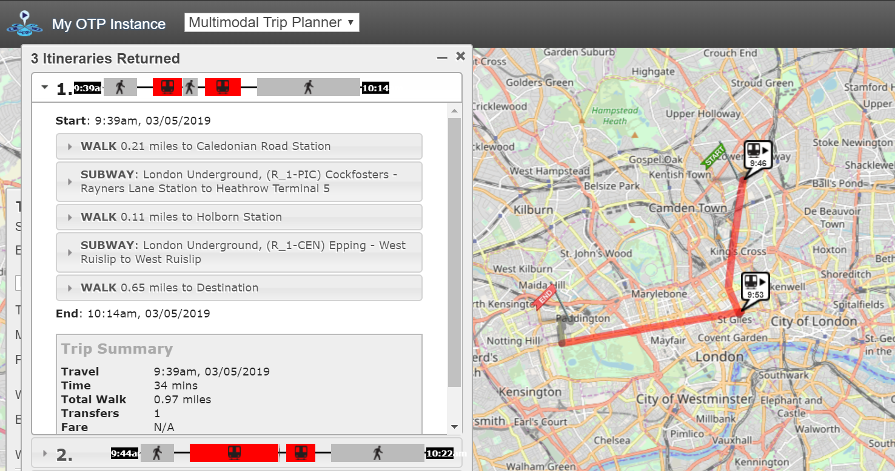

# transx2gtfs 
[](https://badge.fury.io/py/transx2gtfs) [](https://travis-ci.com/HTenkanen/transx2gtfs) [](https://codecov.io/gh/HTenkanen/transx2gtfs) [](https://doi.org/10.5281/zenodo.3631477) [](https://gitter.im/transx2gtfs/community?utm_source=badge&utm_medium=badge&utm_campaign=pr-badge)

This is a small library to convert transit data from TransXchange format into GTFS -format that
can be used with various routing engines such as OpenTripPlanner. 

## Note!

This package is still in a Beta-phase, so use it at your own risk. 
If you find an issue, you can contribute and 
help solving them by [raising an issue](https://github.com/HTenkanen/transx2gtfs/issues).

## Features

 - Reads TransXchange xml-files and converts into GTFS feed with all necessary information 
 according the General Transit Feed Specification.
 - Works and tested against different TransXchange schemas (TfL schema and TXC 2.1)
 - Combines multiple TransXchange files into a single GTFS feed if present in the same folder.
 - Finds and reads all XML files present in ZipFiles, nested ZipFiles and unpacked directories. 
 - Uses multiprocessing to parallelize the conversion process.
 - Parses dates of non-operation (bank holidays etc.) which are written to calendar_dates.txt.
 - Reads and updates stop information automatically from NaPTAN website.  

## Install

The package is available at PyPi and you can install it with:

`$ pip install transx2gtfs`

Library works and is being tested with Python versions 3.6, 3.7 and 3.8.  

## Basic usage

After you have installed the library you can use it in a following manner:

```python
>>> import transx2gtfs
>>> data_dir_for_transxchange_files = "data/my_transxchange_files"
>>> output_path = "data/my_converted_gtfs.zip"
>>> transx2gtfs.convert(data_dir_for_transxchange_files, output_path)
```

There are a few parameters that you can adjust:

```
input_filepath : str
    File path to data directory or a ZipFile containing one or multiple TransXchange .xml files.
    Also nested ZipFiles are supported (i.e. a ZipFile with ZipFile(s) containing .xml files.)

output_filepath : str
    Full filepath to the output GTFS zip-file, e.g. '/home/myuser/data/my_gtfs.zip'

append_to_existing : bool (default is False)
    Flag for appending to existing gtfs-database. This might be useful if you have
    TransXchange .xml files distributed into multiple directories (e.g. separate files for
    train data, tube data and bus data) and you want to merge all those datasets into a single
    GTFS feed.

worker_cnt : int
    Number of workers to distribute the conversion process. By default the number of CPUs is used.

file_size_limit : int
    File size limit (in megabytes) can be used to skip larger-than-memory XML-files (should not happen).
```

## Output

After you have successfully converted the TransXchange into GTFS, you can start doing
multimodal routing with your favourite routing engine such as OpenTripPlanner:



## Citation

If you use this tool for research purposes, we encourage you to cite this work:

 - Henrikki Tenkanen. (2020). transx2gtfs (Version v0.3.5). Zenodo. http://doi.org/10.5281/zenodo.3631477

## Developers

- Henrikki Tenkanen, University College London