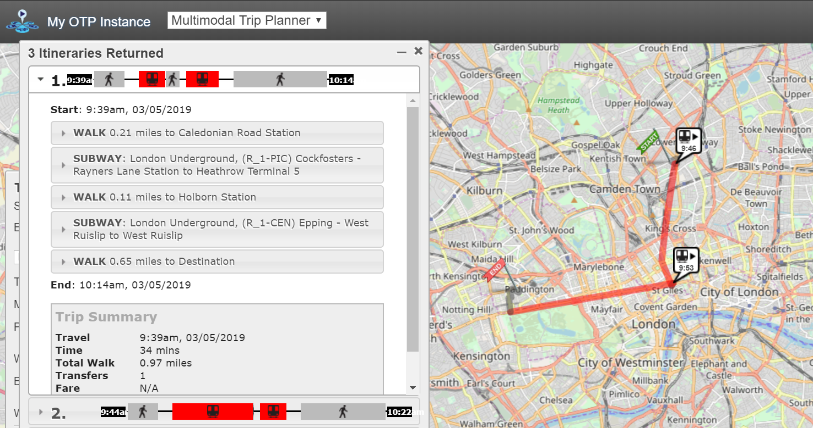

# transx2gtfs 
[](https://badge.fury.io/py/transx2gtfs) [](https://github.com/HTenkanen/transx2gtfs/actions/workflows/tests.yaml) [](https://doi.org/10.5281/zenodo.3628736) [](https://gitter.im/transx2gtfs/community?utm_source=badge&utm_medium=badge&utm_campaign=pr-badge)

**transx2gtfs** is a library for converting public transport data from [TransXchange](https://www.gov.uk/government/collections/transxchange) -format 
(data standard in UK) into a widely used [GTFS](https://developers.google.com/transit/gtfs) -format that can be used with 
various routing engines such as OpenTripPlanner. 

## Note!

This package is still in a Beta-phase, so use it at your own risk. 
If you find an issue, you can contribute and 
help solving them by [raising an issue](https://github.com/HTenkanen/transx2gtfs/issues).

## Features

 - Reads TransXchange xml-files and converts into GTFS feed with all necessary information 
 according the General Transit Feed Specification.
 - Works and tested against different TransXchange schemas: the TfL schema, TXC 2.1 and the
 TXC 2.4/2.5 files published by the [Bus Open Data Service](https://data.bus-data.dft.gov.uk/)
 and the Traveline National Dataset (multi-section journey patterns, journeys defined by
 reference, frequency-based journeys written to `frequencies.txt`, wait times and journey
 timing-link overrides, interpolated times at non-timing stops, several lines per service).
 - Combines multiple TransXchange files into a single GTFS feed if present in the same folder.
 - Leaves out files superseded by a newer revision of the same service (change archives such as the
 Bus Open Data Service bulk download hold several versions): per ServiceCode, among versions whose
 operating periods overlap only the highest `RevisionNumber` is converted (`skip_superseded`).
 - Finds and reads all XML files present in ZipFiles, nested ZipFiles and unpacked directories. 
 - Uses multiprocessing to parallelize the conversion process.
 - Parses bank holidays (from [gov.uk](https://www.gov.uk/bank-holidays)) affecting transit operations at the given time span of the TransXChange feed, which are written to calendar_dates.txt: every TransXChange holiday name and group (`AllBankHolidays`, `Christmas`, `HolidayMondays`, displacement holidays, …), Scottish holidays for files whose stops are in Scotland, `SpecialDaysOperation` date ranges and `ServicedOrganisations` (term-time) calendars.
 - Reads stop information automatically from the [NaPTAN](https://www.gov.uk/government/publications/national-public-transport-access-node-schema) API (or from a local NaPTAN CSV file).
 
## Why yet another converter?

There are numerous TransXChange to GTFS converters written in different programming languages. 
However, after testing many of them, it was hard to find a tool that would:

 1. work in general (without ad-hoc modifications)
 2. parse all important information from the TransXChange according GTFS specification.
 3. work with different TransXChange schema versions
 4. be well maintained
 5. be easy to use in all operating systems
 6. include appropriate tests (crucial for maintenance).
 
Hence, this Python package was written which aims at meeting the aforementioned requirements. 
It's not the fastest library out there (written in Python) but multiprocessing gives a bit of boost
if having a decent computer with multiple cores.

## Install

The package is available at PyPI and you can install it with:

`$ pip install transx2gtfs`

transx2gtfs requires Python 3.10 or newer and is tested on Python 3.10–3.14 on Linux, macOS and Windows.

If you don't know how to install Python, you can take a look for example [these materials](https://geo-python.github.io/site/course-info/installing-anacondas.html).

### Requirements

transx2gtfs depends on:

 - lxml (>= 5.0)
 - pandas (>= 2.0)
 - pyproj (>= 3.0)

## Basic usage

After you have installed the library you can use it in a following manner:

```python
>>> import transx2gtfs
>>> data_dir_for_transxchange_files = "data/my_transxchange_files"
>>> output_path = "data/my_converted_gtfs.zip"
>>> transx2gtfs.convert(data_dir_for_transxchange_files, output_path)
```

There are a few parameters that you can adjust:

```
input_filepath : str
    File path to data directory or a ZipFile containing one or multiple TransXchange .xml files.
    Also nested ZipFiles are supported (i.e. a ZipFile with ZipFile(s) containing .xml files.)

output_filepath : str
    Full filepath to the output GTFS zip-file, e.g. '/home/myuser/data/my_gtfs.zip'

append_to_existing : bool (default is False)
    Flag for appending to existing gtfs-database (the database of the same output file,
    `<output without .zip>.db` next to it: `my_gtfs.zip` uses `my_gtfs.db`). This might be
    useful if you have
    TransXchange .xml files distributed into multiple directories (e.g. separate files for
    train data, tube data and bus data) and you want to merge all those datasets into a single
    GTFS feed.

worker_cnt : int
    Number of worker processes. By default the number of CPUs minus one is used.

file_size_limit : int
    File size limit (in megabytes) can be used to skip larger-than-memory XML-files (should not happen).

skip_superseded : bool (default is True)
    Leave out files superseded by a newer version of the same service: per ServiceCode, among
    versions whose operating periods overlap only the highest RevisionNumber is converted.
    Dropped files are logged (INFO).

naptan_path : str (default is None)
    Local NaPTAN CSV to read stop coordinates from. By default TRANSX2GTFS_NAPTAN_PATH is used
    if set, else a copy downloaded into the user's cache directory (refreshed when older than
    30 days).

refresh_naptan : bool (default is False)
    Download the NaPTAN data anew even if the cached copy is recent.

log_file : str (default is None)
    Append the progress messages and the data warnings of the conversion (with time and
    level) to this file, in addition to the console.
```

Progress messages go through the `transx2gtfs` logger of the standard `logging` module
(INFO level, printed to the console unless logging has been configured by the application);
data problems are reported with `warnings.warn` and also written to the log file when one
is given.

The conversion runs in worker processes. On macOS and Windows those are started with
the `spawn` method, so when you call `convert()` from a script, put the call under an
`if __name__ == "__main__":` guard:

```python
import transx2gtfs

if __name__ == "__main__":
    transx2gtfs.convert("data/my_transxchange_files", "data/my_converted_gtfs.zip")
```

### Command line

The same conversion is available from the command line (`transx2gtfs` or `python -m transx2gtfs`):

```
$ transx2gtfs data/my_transxchange_files data/my_converted_gtfs.zip
$ transx2gtfs --help
```

Options: `--append` (append to the intermediate database of a previous run with the same
output file), `--workers N`,
`--file-size-limit MB`, `--keep-superseded` (convert every file, also versions superseded by a
newer revision of the same service), `--naptan-path FILE`, `--refresh-naptan`, `--log-file FILE` and `--version`.

### Stop and bank holiday data

Stop coordinates are read from the national NaPTAN dataset, which is downloaded (about
100 MB) into the user's cache directory (`~/.cache/transx2gtfs` or `$XDG_CACHE_HOME/transx2gtfs` on Linux,
`~/Library/Caches/transx2gtfs` on macOS, `%LOCALAPPDATA%\transx2gtfs` on Windows; override
with `TRANSX2GTFS_CACHE_DIR`), reused on later runs and refreshed when older than 30 days (if
the refresh fails, the cached copy is used with a warning). To use a local copy instead (for
example when working offline), pass `naptan_path=` / `--naptan-path` or point
`TRANSX2GTFS_NAPTAN_PATH` at a NaPTAN CSV file downloaded from
https://naptan.api.dft.gov.uk/v1/access-nodes?dataFormat=csv.
Bank holidays are read from [gov.uk](https://www.gov.uk/bank-holidays.json), falling back to a
copy bundled with the package; `TRANSX2GTFS_BANK_HOLIDAYS_PATH` can point at a local copy of
that JSON file.

## Output

After you have successfully converted the TransXchange into GTFS, you can start doing
multimodal routing with your favourite routing engine such as OpenTripPlanner:



## Citation

If you use this tool for research purposes, we encourage you to cite this work:

 - Henrikki Tenkanen. (2026). transx2gtfs (Version v0.6.0). Zenodo. https://doi.org/10.5281/zenodo.3628736

## Developers

- Henrikki Tenkanen, Aalto University

### Development setup

```
$ git clone https://github.com/HTenkanen/transx2gtfs.git
$ cd transx2gtfs
$ pip install -e .[test]
$ pytest
```

The tests run offline: stops come from a small NaPTAN subset in `tests/data/` and bank
holidays from the bundled file. Code is formatted with `black` and checked with `flake8`
(`pre-commit install` sets up both as git hooks).
